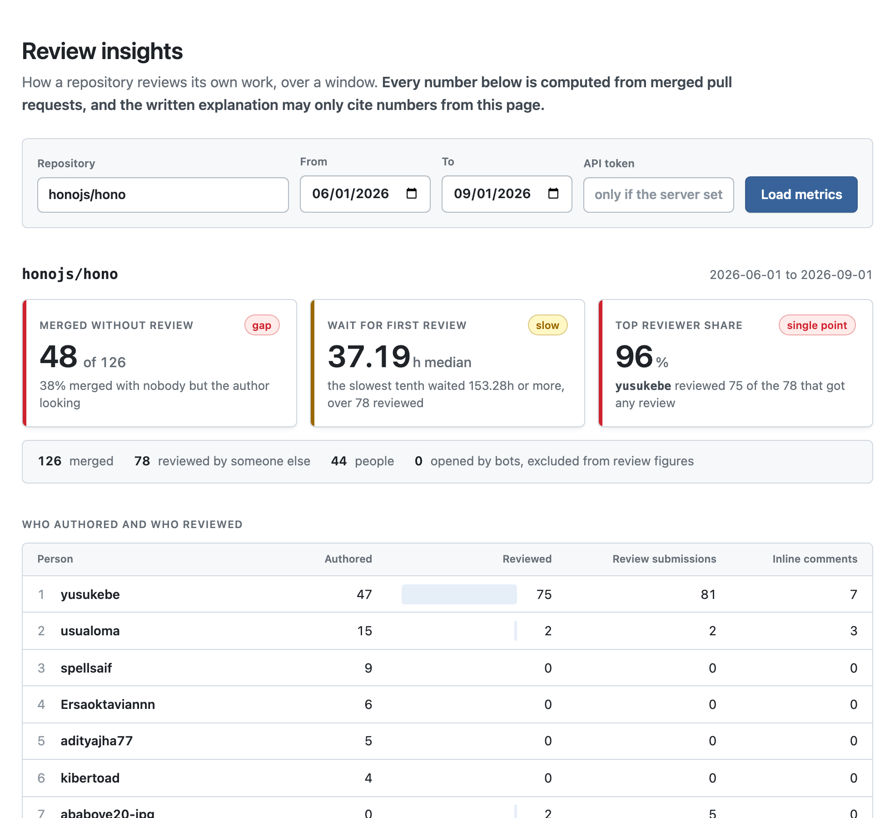
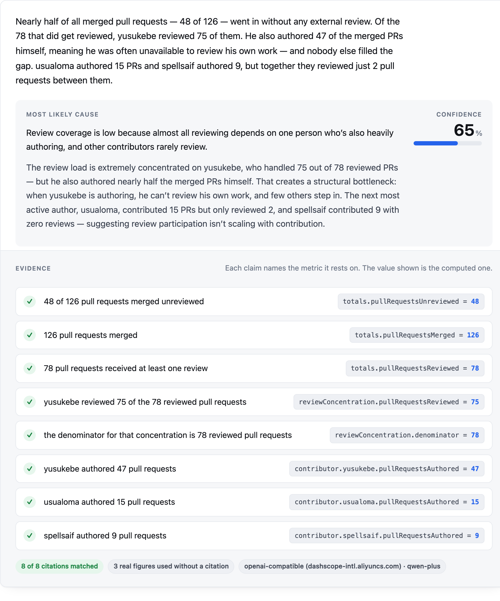
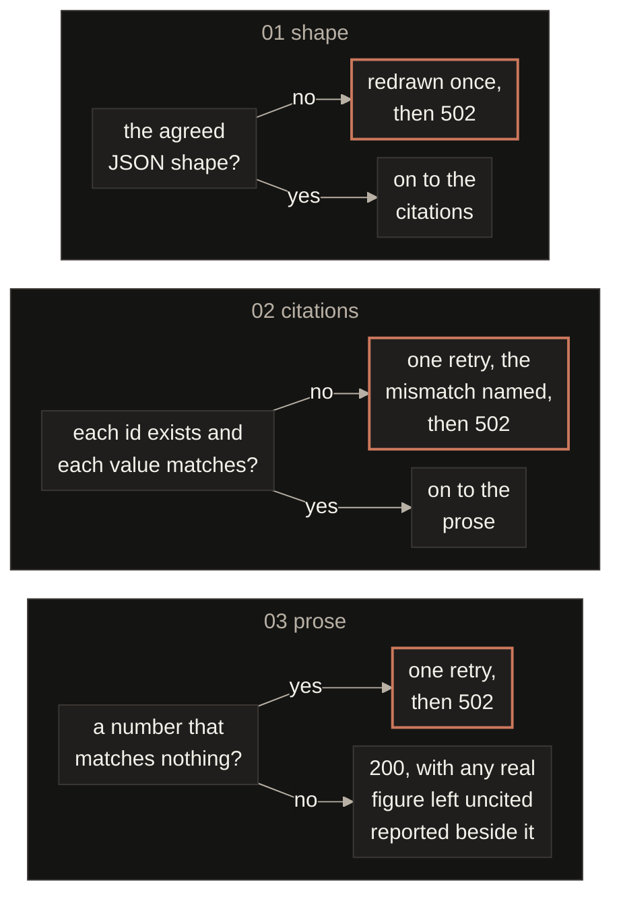
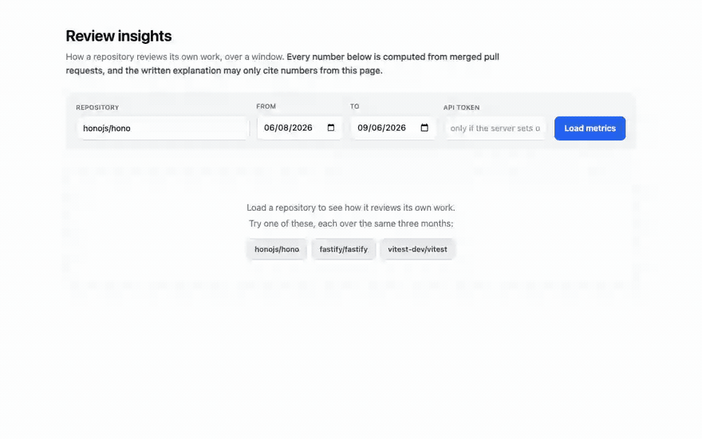
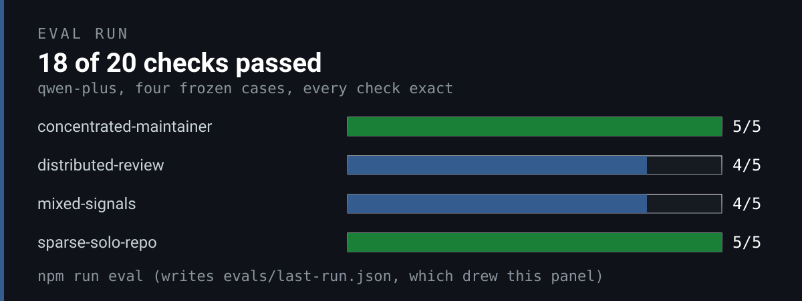

<p align="center">
  
</p>

<div align="center">

<b><font size="6">Review insights</font></b>

<br/>


<br/><br/>

<strong>Three review signals from a repository's merged pull requests, and a narrative that has to cite them.</strong><br/>
A Fastify service on the GitHub GraphQL API, one metrics endpoint, one narrative endpoint, and a check that fails the request when the model's numbers do not match the computed ones.

<br/>

<code>fetch -> compute -> fact table -> model -> check -> answer</code>

</div>

```bash
cp .env.example .env     # a GitHub token, and an LLM key for the narrative
npm install
npm run dev              # API and web page on localhost:8080
npm test                 # 134 tests, no network, no key
npm run eval             # four frozen cases against the configured model
npm run verify           # recomputes every number this page states, from frozen payloads
npm run figures:check    # redraws every figure and fails if this page drifted
docker compose up        # the same in a container, GITHUB_TOKEN and ANTHROPIC_API_KEY from the shell
```

```bash
curl 'localhost:8080/v1/insights?repo=honojs/hono&from=2026-06-01&to=2026-09-01'
curl 'localhost:8080/v1/insights/narrative?repo=honojs/hono&from=2026-06-01&to=2026-09-01'
```

A classic token with no scopes ticked is enough, since only public repositories are read. Without an LLM key the metrics endpoint works and the narrative endpoint answers 503 saying so.

---

**Three signals, and where each one's truth comes from.**

| | The question it answers | Where its truth comes from | On hono, summer 2026 |
|:---|:---|:---|:---|
| **Merged without review** | How much merges with nobody but the author looking? | Merged pull requests with no review from anyone else | 48 of 126 |
| **Wait for first review** | When review comes, how long did the change sit? | Hours from opening to the first outside review, median and p90 | A median of 37 hours and a tail past six days |
| **Top reviewer share** | Is review a shared habit or one person's job? | Reviewed pull requests touched by the single busiest reviewer | One person on 75 of 78 |

Commit counts say little about how a team works. These three separate a team that reviews each other's work from one where a single maintainer is the bottleneck. On `honojs/hono` one maintainer reviewed 96% of everything. On `fastify/fastify`, same window, the busiest reviewer is at 47%, one pull request went unreviewed, and the median first review lands in about eight hours.

<table>
  <tr>
    <td width="33%" align="center" valign="top"><a href="#1-the-metric"><b>1. Metric</b></a><br><code>no network, no clock, no database</code><br><a href="#1-the-metric">See the rules</a></td>
    <td width="33%" align="center" valign="top"><a href="#2-the-grounded-narrative"><b>2. Narrative</b></a><br><code>a mismatch is a 502</code><br><a href="#2-the-grounded-narrative">See the check</a></td>
    <td width="33%" align="center" valign="top"><a href="#3-the-eval-suite"><b>3. Eval</b></a><br><code>median 90% over 8 runs</code><br><a href="#3-the-eval-suite">See the suite</a></td>
  </tr>
</table>

---

## 1. The metric

The window is the pull requests merged in `[from, to)`, and every number comes out of one pure function, `computeInsights` in [`src/metrics/compute.ts`](src/metrics/compute.ts).

- Bots are separated, not dropped. `pullRequestsMerged` counts everything merged so it can be checked against GitHub's own search, bot-authored pull requests are reported apart and leave every review figure, and the account type comes from GraphQL's `__typename` rather than the login, because `dependabot` arrives with no marker in its name. On fastify that alone moved the top reviewer's share five points, 0.4231 to 0.4727.
- A capped sample withholds its statistics. GitHub search stops at 1000 results, so past that the counts are floors, the median and the share come back null, and the model is told the window is incomplete before it writes a word.
- A private repository gets a 403 whatever the token could see, so this endpoint cannot be used to read private activity.

<p align="center"></p>

| Step | What has to hold before the next step runs | What pins it |
|:---|:---|:---|
| Fetch | One search query with `merged:` as its qualifier, so nothing outside the window is downloaded, 50 pull requests a page and 100 reviews each | A 404 for a missing repository, a 403 for a private one, a 429 when GitHub rate limits, each named rather than a bare 500, in `answers 429 when GitHub rate limits us, rather than a bare 500` |
| Window | Half open, so a merge at the `to` instant belongs to the next period | The test `treats the window as half open, so to belongs to the next period`, and a 400 for a window that runs backwards, is empty or is past 366 days, where the result cap starts to bite |
| Review | A review by the author never counts, a deleted account still counts on both sides, and a review timestamped before its own pull request is clamped to zero rather than reported as negative time | The tests `does not let an author review their own pull request` and `survives a deleted account on both the author and the reviewer side` |
| Sum | Reviewed plus unreviewed plus bot-authored equals merged | The test `reconciles: reviewed plus unreviewed plus bot-authored equals merged`, and `npm run verify` checks it on both frozen payloads |
| Rank | The p90 takes the nearest rank, so it is always an observed wait, and the median averages the middle pair on an even sample | The tests `takes the nearest rank, so p90 is always an observed value` and `averages the middle pair for an even sample, which is the one interpolated value` |

## 2. The grounded narrative

The model gets a fact table, one line per number with an id, a value and a unit, and may cite nothing else.

- The guarantee lives in the evidence array, which is bound to metric ids and checked exactly. The prose scan behind it has two tiers. A number matching nothing computed fails the request, and a real figure the model used without citing is reported beside the answer, because refusing a sound answer over bookkeeping was measured and rejected, 18 of 20 fell to 16 and 17 when the retry went on tidying instead of on fabrications.
- The wait's percentile is named by its id. The prompt asks for p90 and a citation of `reviewLatency.p90Hours`, a cited p90 is read as a name and an uncited one as a claim with nothing behind it, and the spelled out ordinal, 90th or ninetieth percentile in any form, is refused. Nine rounds of grammar tried to parse the English instead and never converged.
- A failed check is one retry with the failure named, then a 502 with the report attached, never a 200 with a warning, because a client that renders the prose and ignores the metadata would show known bad numbers under a success.

<p align="center"></p>

| Step | What has to hold before the next step runs | What pins it |
|:---|:---|:---|
| Facts | The fact table comes from `buildFactSet`, the totals, the wait, the concentration and the top contributors as `id = value (unit) : description`, and that table is the whole of what the model may cite | The test `exposes every number the API reports so the model can cite all of them` |
| Shape | The reply is JSON in the agreed schema, a hypothesis, a confidence from 0 to 1, an evidence array and the narrative | A malformed reply is redrawn once, then a 502 `model_error`, in `answers 502, not 500, when a provider ignores the schema and returns prose` |
| Citations | Every evidence item names an id that exists and quotes its value, with a JSON round trip's rounding tolerated | One retry with the mismatch spelled out, then a 502 with the report attached, in `fails the request when the model misquotes a number, with the mismatch attached` |
| Prose | Every number in the narrative and the hypothesis matches a fact, whole dates and the window's year excepted, and number words are read as digits | A number matching nothing computed is refused, in `catches a fabricated number hiding in the hypothesis, not just the narrative`, and a real figure left uncited is reported, in `does not spend a draw tidying an unrecorded figure` |
| Label | The wait's percentile appears as p90 with `reviewLatency.p90Hours` cited | The ordinal spelling is refused in every form, in `names the wait percentile by its id, p90, and refuses the ordinal spelling outright` |

Where a request can be refused, in the order the checks run. One retry in total, whichever check spends it.



<p align="center">
  <a href="https://github.com/jameswniu/tempo-loop-assignment/raw/main/docs/images/demo.mp4"></a>
</p>
<p align="center"><sub><a href="https://github.com/jameswniu/tempo-loop-assignment/raw/main/docs/images/demo.mp4">Watch the recording</a></sub></p>

## 3. The eval suite

Four cases frozen from real repositories, a concentrated maintainer, a distributed team, a large mixed one and a solo repository where nobody reviews anything.

- Five checks per case, that the citations ground, that no number is invented, that the metric carrying the story is cited, that the confidence sits in a band written before the model was ever run, and that the evidence chain is not empty. A case the provider never answers, or that comes back in the wrong shape, fails all five, so every run is out of twenty.
- Two providers. `npx tsx evals/run.ts openai` runs the service's own adapter, the deployed path, against the model the machine is configured for, here `qwen-plus`. `npx tsx evals/run.ts claude-code` shells out to the Claude Code command line on a subscription login, with no settings, tools or servers loaded, which measures the model and not the path.

<p align="center"></p>

| Run | The deployed path, `qwen-plus` | The command line, `claude-sonnet-5` |
|:---|:---|:---|
| 1 | 9 of 20 | 20 of 20 |
| 2 | 17 of 20 | 15 of 20 |
| 3 | 18 of 20 | 20 of 20 |
| 4 | 19 of 20 | 19 of 20 |
| 5 | 18 of 20 | 19 of 20 |
| 6 | 9 of 20 | 19 of 20 |
| 7 | 18 of 20 | 20 of 20 |
| 8 | 18 of 20 | 20 of 20 |
| Median | 90% | 97.5% |

The deployed path carries the page. Over eight runs `qwen-plus` scored a median of 90%, with the two runs that lost two cases each to provider timeouts counted at full weight, and what still fails on the runs that completed is one thing, totals added up in the prose that the fact table never held. The command line path compares the model and not the path, since it is not the SDK adapter a request takes, and the Anthropic adapter itself has not been run, which needs a paid key. Every sample, and what each model gets wrong, is in [NOTES.md](NOTES.md).

## The request, as a map

One query in, one checked answer out, and where each step can refuse.

<p align="center">
  
</p>

## Recounted on every `npm run verify`

`npm run verify` recomputes every number this page states about hono and fastify from the payloads frozen in `evals/cases/raw`, and `npm run figures:check`, which CI runs, redraws every figure from the same payloads, the suite and `evals/sample.json`, then fails when a badge, a hero card, a table row or a sentence above stops matching.

```
honojs/hono, the concentrated case
  top reviewer share                                       96%
  merged with no outside review                            48 of 126
  median hours to first outside review                     37.19
```

## What I left out, and why

- The cache does not revalidate visibility. A public repository that goes private stays served from cache until the 15 minute TTL runs out, because checking on every hit costs the upstream request the cache exists to avoid.
- The container runs without a token, on a declaration. `PUBLISHED_ON` tells the process its port is published on the host's loopback, which is what lets it bind `0.0.0.0` inside the container, and the process says at boot that its safety rests on a claim it cannot verify. Anyone deploying this for real sets `API_TOKEN`.
- A real figure used without a citation is reported, not refused. The adversarial review argued four times that it should fail the request. Refusing would reject most sound answers, since nearly every run carries one, and spending the retry on it made the suite worse.
- The prose scan cannot judge a sentence. One run wrote that a reviewer handled over half of the reviewed pull requests when the figure was 52 of 110, and there is no digit in over half. The exact guarantee lives in the evidence array.
- One known residual in the label rule. A login shaped like `p90-dev` reads as the label, so an answer naming that contributor without citing p90 is refused rather than passed. It fails closed, and masking the logins the fact table already knows is the five line fix.
- The Anthropic adapter, the shipped default, has not been measured, because it needs a paid key. The default model was measured through the command line instead, and that number stays out of the badge and the hero.
- No commit or issue signals, and no splitting of a window past the 1000 result cap. Both would widen the story, and a smaller thing I can fully explain seemed better than a larger one I could not.

More in [NOTES.md](NOTES.md), and a card for every number above in [docs/REFEREE.md](docs/REFEREE.md).
