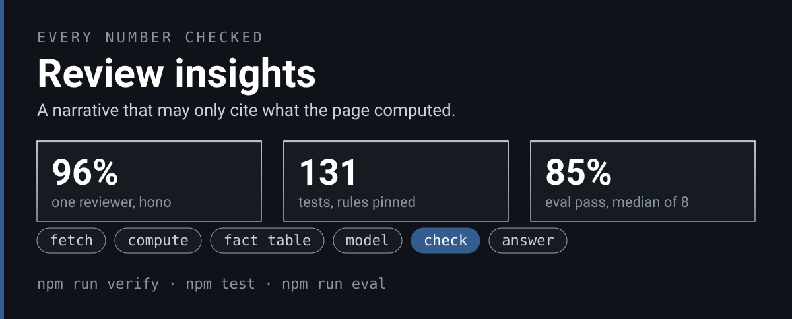
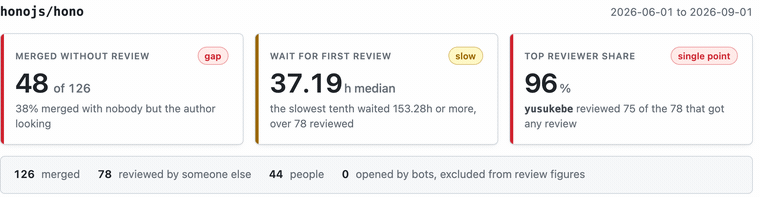
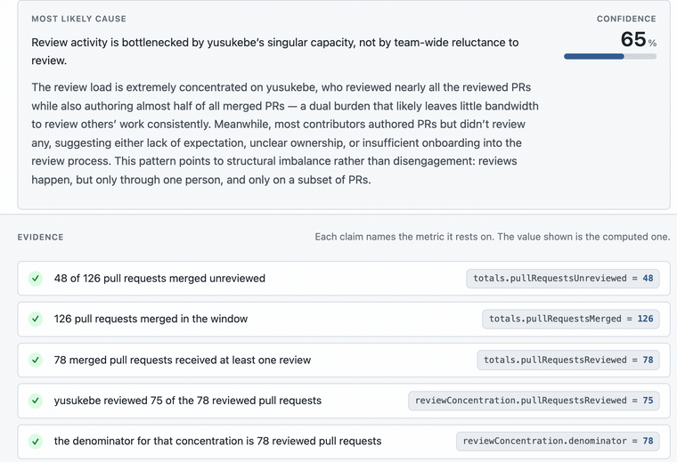
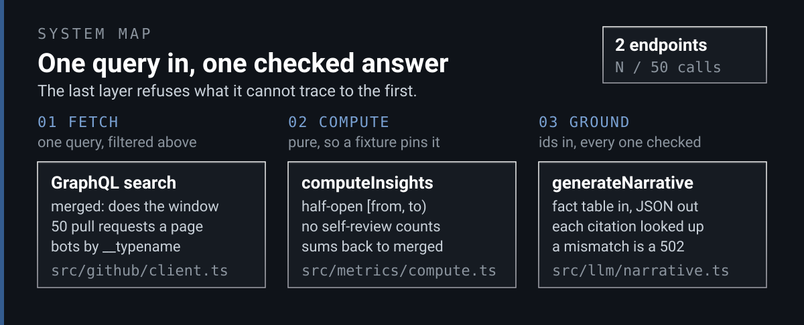

<p align="center">
  
</p>

<p align="center"><em>A model can write the explanation. It cannot be the one who checks it.</em></p>

<div align="center">

<b><font size="6">Review insights</font></b>

</div>

<p align="center">
<a href="https://github.com/jameswniu/tempo-loop-assignment/actions/workflows/checks.yml"></a>


</p>

<div align="center">

<br/>

<strong>A service that reads a GitHub repository's merged pull requests and reports how the team reviews its own work.</strong><br/>
A second endpoint asks a language model to explain the numbers, then checks every figure in the answer against the numbers it was given.<br/>
If a figure does not match, the request fails. The model never gets the last word.

<br/>

<code>fetch -> compute -> fact table -> model -> check -> answer</code>

</div>

---

**Three figures carry the page, and each answers a different question.**

| | The question it answers | Where its truth comes from | What it looks like when it is bad |
|:---|:---|:---|:---|
| **Merged without review** | How much ships with nobody but the author looking? | Merged pull requests with no review from anyone else | 48 of 126 on hono this summer |
| **Wait for first review** | When review happens, how long does a change sit first? | Hours from opening to the first outside review, median and p90 | A median of 37 hours and a tail past six days |
| **Top reviewer share** | Is review a shared habit or one person's job? | Reviewed pull requests touched by the single busiest reviewer | One person on 75 of 78 |

Contributor counts by commits are easy to compute and say almost nothing. These three separate a team that reviews each other's work from one where a single maintainer is both the bottleneck and the queue. Run them over `honojs/hono` and one maintainer reviewed 96% of everything. Run them over `fastify/fastify` for the same window and the busiest reviewer is at 47%, one pull request went unreviewed, and the median first review lands in about eight hours. Same three numbers, two different working cultures.

<table>
  <tr>
    <td width="33%" align="center" valign="top"><a href="#1-the-metric"></a><br><b>The metric.</b> Every number is computed by a pure function over merged pull requests, and a fixture with hand-checked expectations pins each counting rule. <a href="#1-the-metric">See the rules</a></td>
    <td width="33%" align="center" valign="top"><a href="#2-the-grounded-narrative"></a><br><b>The narrative.</b> The model gets a fact table and may cite nothing else. Every citation is looked up before a word is shown. <a href="#2-the-grounded-narrative">See the check</a></td>
    <td width="33%" align="center" valign="top"><a href="#3-the-eval-suite"></a><br><b>The eval.</b> Four cases frozen from real repositories, every check exact, run before any change to the prompt or the model. <a href="#3-the-eval-suite">See the suite</a></td>
  </tr>
</table>

---

## Run it

```bash
cp .env.example .env      # add a GitHub token, and an LLM key for the narrative
npm install
npm run dev
```

```bash
curl 'localhost:8080/v1/insights?repo=honojs/hono&from=2026-06-01&to=2026-09-01'
curl 'localhost:8080/v1/insights/narrative?repo=honojs/hono&from=2026-06-01&to=2026-09-01'
```

Or the whole thing, API and web page together on http://localhost:8080

```bash
GITHUB_TOKEN=... ANTHROPIC_API_KEY=... docker compose up
```

A classic GitHub token with no scopes ticked is enough, since the service only reads public repositories. Without an LLM key the metrics endpoint works and the narrative endpoint returns 503 saying so. `npm test` runs the suite, `npm run eval` runs the model evaluation, and `npm run verify` recomputes every number this page states from frozen payloads.

<p align="center">
  
</p>

---

## 1. The metric

The window is the set of pull requests merged in `[from, to)`. A pull request belongs to it by the instant it merged, so an open one is never counted and one merged exactly at `to` belongs to the next window.

Every number comes out of one pure function, `computeInsights` in [`src/metrics/compute.ts`](src/metrics/compute.ts). No network, no clock, no database. That is what lets a fixture with hand-checked expectations pin each rule, and those tests are the ones I would keep if I could keep only one file.

The rules a reader can check against that file. A bot is identified by the account type GitHub reports, because GraphQL returns `dependabot` and `github-actions` with no marker in the login. Bot-authored pull requests are counted in the merged total, so it reconciles with GitHub's own search, and then left out of every review figure. A review by the author never counts. Review latency runs from opening to the first review by somebody else, and a pull request nobody else reviewed is excluded from that sample rather than counted as infinitely slow. The concentration share divides by reviewed pull requests, not merged ones, so it answers "when review happens, how often is it the same person".

Reviewed plus unreviewed plus bot-authored equals merged, and a test asserts it.

<p align="center"></p>

## 2. The grounded narrative

The model never sees raw JSON. It gets a fact table, one line per number, each with an id, a value, a unit and a plain description, and it is told it may cite nothing else. The answer comes back as structured output through a forced tool call. Then the service checks the model's own work.

Every evidence item names a metric id, and the service looks it up and compares the value exactly. Every number in the prose, the hypothesis and the reasoning must have a counterpart among the facts the model cited. A number that matches nothing computed is a fabrication and fails the request. The wait's percentile is named by its id, p90, which is a claim about one metric and fails the request unless that metric is cited. The spelled-out form, the 90th percentile, is refused outright, because whether it names the wait or something else is a question of English the scanner cannot settle. A number that matches a computed value the model did not cite is real but unrecorded, and is reported beside the answer by value so a reader can audit it.

A failed check is not a 200 with a warning. An earlier version returned exactly that, and it meant any client that rendered the prose and ignored the metadata showed fabricated numbers under a success status. The endpoint now retries once, with the exact failures named in the correction, and then returns 502 with the report attached.

<p align="center"></p>

<p align="center">
  <a href="https://github.com/jameswniu/tempo-loop-assignment/raw/main/docs/images/demo.mp4"></a>
</p>
<p align="center"><sub><a href="https://github.com/jameswniu/tempo-loop-assignment/raw/main/docs/images/demo.mp4">Watch the recording</a></sub></p>

## 3. The eval suite

Four cases frozen from real repositories, chosen for different shapes. A concentrated maintainer, a distributed team, a large mixed one, and a solo repository where nobody reviews anything. Each asserts that the citations ground, that no number is invented, that the model reached for the metric that carries the story, and that its confidence sits in a band written before the model was ever run. Cases run concurrently, so a full run is about 25 seconds.

<p align="center"></p>

The panel above is drawn from `evals/last-run.json`, which the suite writes on every run, so it shows the most recent run rather than the typical one. The headline number is the deployed path, the service's own adapter with the model this machine is configured for, `qwen-plus` through an OpenAI-compatible endpoint. Eight consecutive runs scored 17 to 19 of 20 on the six that completed and lost two cases each to provider timeouts on the other two, and a lost case is five failed checks, so the eight runs read 9, 17, 18, 19, 18, 9, 18 and 18 of 20, a median of 90%. What it gets wrong when it answers is one thing, adding contributors' counts into a total that appears nowhere in the fact table, and the service refuses those answers. That is the gate working, and it is the number worth reporting, how often a given model produces an answer this service will accept.

The shipped default model, `claude-sonnet-5`, is measured separately through the Claude Code command line on a subscription login, `npm run eval -- claude-code`. Same model, same prompts, same schema, no key, and 19 or 20 of 20 on seven of eight consecutive runs, with one case lost to a command line timeout on the eighth, a median of 97.5%. That is a comparison of the model and not of the deployed path, because the command line is not the SDK adapter the service calls, so it stays out of the badge. Its first eight runs scored a median of 90%, and every miss was the number 90. The model writes "90th percentile" for the p90 wait, and the scanner read the ordinal as a figure. That was a scanner defect, fixed and pinned by tests, and both models were re-measured on the fixed scanner. The numbers above are from that second measurement.

Reaching them took measured runs and found four defects no stub could reach. The prompt contradicted itself. Instructions in a system message made one provider return an empty evidence array every time while the narrative came back fine. Telling the model to cite everything led it to write metric ids inline in the prose instead of filling the array, because nothing had said the two fields have different jobs. And the ordinal, which one model never wrote and the other wrote every time.

---

## Who drove, and who watched

Claude Code wrote most of the code from my direction, and a second model instructed to refute rather than approve read every change before each commit. Nine rounds on the last change alone, and the findings were real, a compose file that never passed the second provider's key into the container, an eval that could quietly drop a provider it was meant to compare. What that review found, the one finding I held against, and why, is in [NOTES.md](NOTES.md#what-i-used-ai-for).

## Code map

| Where | What it is |
|:---|:---|
| `src/github/client.ts` | One paginated GraphQL search with the `merged:` qualifier, so the window is filtered upstream. Bots by `__typename`, private repositories refused with a 403 |
| `src/metrics/compute.ts` | The pure function. Pull requests and a window in, every number out. No clock, no network, no database |
| `src/llm/facts.ts`, `grounding.ts`, `narrative.ts` | The fact table the model is shown, the citation lookup and the prose number scan, and the retry loop that ends in a 502 rather than a warning |
| `src/llm/provider.ts` | The two adapters, Anthropic and OpenAI-compatible, both forced to structured output, with a timeout budget shared across retries |
| `src/service.ts`, `src/cache/store.ts` | Fetch, cache and compute tied together. SQLite keyed on the exact query, no extra service to start |
| `src/server.ts`, `src/routes/params.ts` | Fastify, the two endpoints, the origin and bearer guards scoped to `/v1`, strict window parsing |
| `src/config.ts` | Zod over the environment. The loopback rule, the per-provider model defaults, the refusal to bind wide without a token |
| `frontend/src/` | The React page. One screen, the figures, the table, and the narrative rendered beside its evidence chain |
| `test/` | The suite. The counting rules pinned on a hand-checked fixture, the scan, the parsers, the guards |
| `evals/` | Four frozen cases, the runner, the committed eight-run sample, and the last run the panel is drawn from |
| `tools/` | `verify-claims.ts` recomputes the prose numbers, `figures.ts` draws the page, `capture-raw.ts` freezes a repository |
| `docs/REFEREE.md` | A card for every number a reader of this page sees. What is counted, the denominator, the rule, the command |

## Recounted on every push

The three hero numbers are measured, never typed. `tools/figures.ts` recomputes the 96% from the frozen hono payload, runs the suite for the test count, takes the eval median from `evals/sample.json`, regenerates the three figures, and then holds this page and NOTES to those values. The workflow runs typecheck, the suite, that check, and both builds on every push, with a read-only token.

```
git clone https://github.com/jameswniu/tempo-loop-assignment
cd tempo-loop-assignment && npm ci && npm run figures:check
```

It prints one `ok` line per figure and per held value, or names the first thing that drifted and exits 1.

## Where the claims stop

- Every number on this page is for two public repositories over one window, 2026-06-01 up to but not including 2026-09-01, frozen on 5 September 2026. Nothing is re-fetched when this page is read.
- The headline eval number is the deployed adapter with the model this machine is configured for, `qwen-plus`, not the shipped default model. The Claude figure was measured through the Claude Code command line, not through the SDK adapter the service calls. Same model, prompts and schema, but the command line adds system text of its own that the adapter never sends, and the Anthropic adapter path has not been run.
- The confidence bands and the checks were written by the same person who wrote the prompt.
- Two of the eight headline runs lost two cases each to a provider timeout at the service's own 30 second limit, and the headline carries them at full weight, five failed checks each. When the provider answers, the same model scores 85 to 95%.
- The median is over eight runs, and eight is a count, not a rate. The panel shows the latest run, which is not the typical one.
- The prose number scan cannot tell whether the sentence around a number is true. The exact guarantee is the evidence array, bound to metric ids.
- A public repository that goes private stays served from cache for up to fifteen minutes.
- Past 1000 merged pull requests in a window, the derived statistics are withheld rather than computed on a biased slice.
- CI holds the three hero numbers. The other figures in the prose are recomputed by `npx tsx tools/verify-claims.ts` and carried by referee cards, and nothing fails when the prose drifts from them.

[NOTES.md](NOTES.md) holds the architecture tour, the decisions and their trade-offs, and what I would do next. [docs/REFEREE.md](docs/REFEREE.md) holds the cards.
